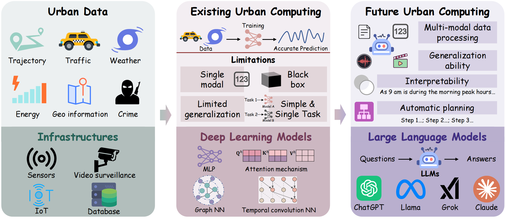
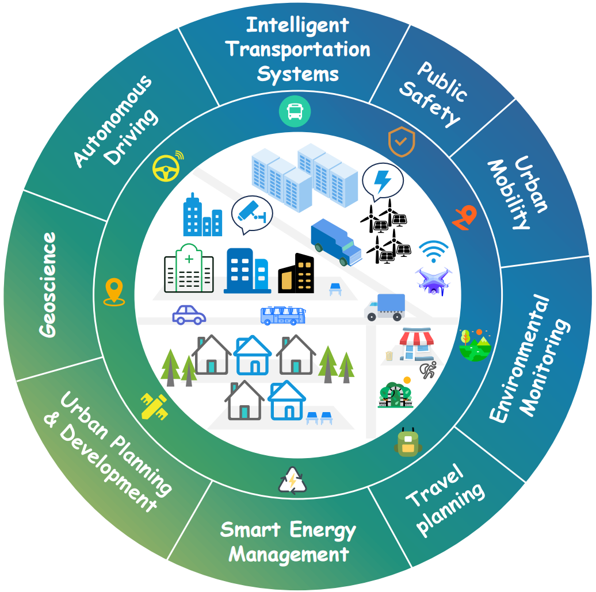
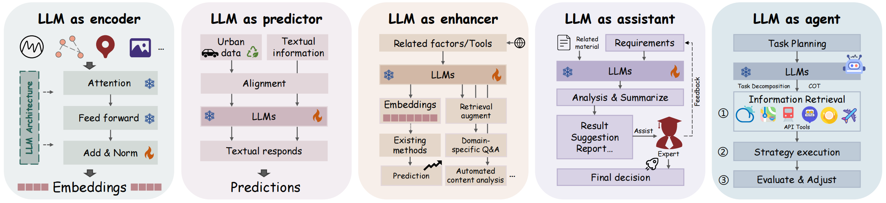

# Awesome-LLM4Urban-Papers

[](https://arxiv.org/abs/2504.02009)
[](https://github.com/HKUDS/Awesome-LLM4Urban-Papers)
 


A collection of papers and resources about Large Language Models (**LLMs**) for Urban Computing.

Urban computing has emerged as a pivotal field at the intersection of data analysis, urban planning, and computer science, aiming to address the complexities of urbanization through technology. Traditional approaches, while beneficial, often struggle with scale and contextual understanding. The advent of Large Language Models (LLMs) offers transformative potential in this domain. LLMs bring significant advantages, including advanced natural language understanding, ability to synthesize diverse data types, and enhanced predictive analytics, which are crucial for dynamic urban environments.

<p align="center">

</p>

<!-- ## News
🤗 We're actively working on this project, and your interest is greatly appreciated! To keep up with the latest developments, please consider hit the **STAR** and **WATCH** for updates.

* Our survey paper: [Urban Computing in the Era of Large Language Models (LLMs)](https://arxiv.org/abs/) is now ready. -->

## Overview
LLMs have shown remarkable capabilities in urban computing, providing innovative solutions and improving efficiency across domains. To clarify their applications, we classify tasks by application scenarios and explore how LLMs can be effectively utilized in each context. These include 1) Intelligent Transportation Systems, 2) Public Safety, 3) Urban Mobility, 4) Environmental Monitoring, 5) Travel Planning, 6) Smart Energy Management, 7) Urban Planning & Development, 8) Geoscience, and 9) Autonomous Driving. We then investigate the application cases of LLMs in these fields, presenting them according to the roles that LLMs play in the solutions: i) Encoder, ii) Predictor, iii) Enhancer, iv) Assistant and v) Agent.


- Various Application Scenarios

<p align='center'>

</p>

- Different Roles of LLMs

<p align='center'>

</p>


## Table of Contents
- [Awesome-LLM4Urban-Papers](#Awesome-LLM4Urban-Papers)
  <!-- - [News](#news) -->
  - [Overview](#overview)
  - [Table of Contents](#table-of-contents)
  <!-- - [Related Resources](#related-resources) -->
  - [🚦 Intelligent Transportation Systems](#-intelligent-transportation-systems)
    - [🔗 LLMs as encoder](#llms-as-encoder-transportation)
    - [✨ LLMs as enhancer & encoder](#llms-as-enhancer-encoder-transportation)
    - [🔮 LLMs as predictor](#llms-as-predictor-transportation)
    - [🤖 LLMs as agent](#llms-as-agent-transportation)
    - [💡 LLMs as assistant](#llms-as-assistant-transportation)
  - [🛡️ Public Safety](#-public-safety)
    - [🔗 LLMs as encoder](#llms-as-encoder-safety)
    - [🔮 LLMs as predictor](#llms-as-predictor-safety)
    - [💡 LLMs as assistant](#llms-as-assistant-safety)
  - [🚶‍♀️ Urban Mobility](#-urban-mobility)
    - [🔗 LLMs as encoder & enhancer](#llms-as-encoder-enhancer-mobility)
    - [🔮 LLMs as predictor](#llms-as-predictor-mobility)
    - [🤖 LLMs as agent](#llms-as-agent-mobility)
  - [🌧️ Environmental Monitoring](#-environmental-monitoring)
    - [✨ LLMs as enhancer](#llms-as-enhancer-environmental)
    - [🔮 LLMs as predictor](#llms-as-predictor-environmental)
    - [🤖 LLMs as agent](#llms-as-agent-environmental)
    - [💡 LLMs as assistant](#llms-as-assistant-environmental)
  - [✈️ Travel Planning](#-travel-planning)
    - [🔗 LLMs as encoder](#llms-as-encoder-travel)
    - [🔮 LLMs as predictor](#llms-as-predictor-travel)
    - [🤖 LLMs as agent](#llms-as-agent-travel)
  - [🏙️ Urban Planning & Development](#-urban-planning--development)
    - [🤖 LLMs as agent](#llms-as-agent-planning)
    - [💡 LLMs as assistant](#llms-as-assistant-planning)
  - [⚡ Smart Energy Management](#-smart-energy-management)
    - [🔗 LLMs as encoder](#llms-as-encoder-energy)
    - [✨ LLMs as enhancer & encoder](#llms-as-enhancer-encoder-energy)
    - [🔮 LLMs as predictor](#llms-as-predictor-energy)
  - [🌍 Geoscience](#-geoscience)
    - [✨ LLMs as enhancer](#llms-as-enhancer-geoscience)
    - [🔮 LLMs as predictor](#llms-as-predictor-geoscience)
    - [🤖 LLMs as agent](#llms-as-agent-geoscience)
  - [🚗 Autonomous Driving](#-autonomous-driving)
    - [🔗 LLMs as encoder](#llms-as-encoder-driving)
    - [✨ LLMs as enhancer](#llms-as-enhancer-driving)
    - [🔮 LLMs as predictor](#llms-as-predictor-driving)
    - [🤖 LLMs as agent](#llms-as-agent-driving)
  - [Citation](#citation)
  - [Acknowledgements](#acknowledgements)


<!-- ## Related Resources
* Large language models on graphs: A comprehensive survey [[paper](https://arxiv.org/pdf/2312.02783)]
* A Survey of Graph Meets Large Language Model: Progress and Future Directions [[paper](https://arxiv.org/pdf/2311.12399)] -->


## 🚦 Intelligent Transportation Systems
### 🔗 LLMs as encoder <a id="llms-as-encoder-transportation"></a>
- (MDM'2024) **Spatial-Temporal Large Language Model for Traffic Prediction** [[paper](https://ieeexplore.ieee.org/document/10591642)] \<Traffic prediction\>
- (arXiv'2024) **TPLLM: A Traffic Prediction Framework Based on Pretrained Large Language Models** [[paper](https://arxiv.org/abs/2403.02221)] \<Traffic prediction>
- (arXiv'2024) **STD-PLM: Understanding Both Spatial and Temporal Properties of Spatial-Temporal Data with PLM** [[paper](https://arxiv.org/abs/2407.09096)] \<Traffic prediction>
- (Sensors'2024) **Spatial-Temporal Transformer Networks for Traffic Flow Forecasting Using a Pre-Trained Language Model** [[paper](https://www.mdpi.com/1424-8220/24/17/5502)] \<Traffic prediction>
- (arXiv'2023) **GATGPT: A Pre-trained Large Language Model with Graph Attention Network for Spatiotemporal Imputation** [[paper](https://arxiv.org/abs/2311.14332)] \<Traffic imputation>
- (arXiv'2024) **STLLM-DF: A Spatial-Temporal Large Language Model with Diffusion for Enhanced Multi-Mode Traffic System Forecasting** [[paper](https://arxiv.org/abs/2409.05921)] \<Traffic imputation>

### ✨ LLMs as enhancer & encoder <a id="llms-as-enhancer-encoder-transportation"></a>
- (arXiv'2024) **STG-LLM: How Can Large Language Models Understand Spatial-Temporal Data?** [[paper](https://arxiv.org/abs/2401.14192)] \<Traffic prediction>
- (arXiv'2024) **STGCN-L: Spatio-Temporal Graph Convolutional Network Combined Large Language Model** [[paper](https://arxiv.org/abs/2403.15733)] \<Traffic prediction>
- (arXiv'2024) **IMPEL: Joint Estimation and Prediction of City-wide Delivery Demand** [[paper](https://arxiv.org/abs/2408.17258)] \<Delivery demand prediction>
- (AAAI'2024) **Prompt to Transfer: Sim-to-Real Transfer for Traffic Signal Control with Prompt Learning** [[paper](https://doi.org/10.1609/aaai.v38i1.27758)] \<Traffic signal control\>
- (arXiv'2024) **iLLM-TSC: Integration reinforcement learning and large language model for traffic signal control policy improvement** [[paper](https://arxiv.org/abs/2407.06025)] \<Traffic signal control\>
- (arXiv'2024) **LLMLight: Large Language Models as Traffic Signal Control Agents** [[paper](https://arxiv.org/abs/2312.16044)] \<Traffic signal control\>
- (arXiv'2024) **TransGPT: Multi-Modal Generative Pre-Trained Transformer for Transportation** [[paper](https://arxiv.org/abs/2402.07233)] \<Diverse traffic management tasks\>
- (Inf Fusion'2024) **GT-TDI: Semantic Understanding and Prompt Engineering for Large-Scale Traffic Data Imputation** [[paper](https://doi.org/10.1016/j.inffus.2023.102038)] \<Traffic imputation\>

### 🔮 LLMs as predictor <a id="llms-as-predictor-transportation"></a>
- (KDD'2024) **UrbanGPT: Spatio-Temporal Large Language Models** [[paper](https://dl.acm.org/doi/10.1145/3637528.3671578)] \<Traffic prediction>
- (arXiv'2024) **Towards Explainable Traffic Flow Prediction with Large Language Models** [[paper](https://arxiv.org/abs/2404.02937)] \<Traffic prediction>

### 🤖 LLMs as agent <a id="llms-as-agent-transportation"></a>
- (arXiv'2023) **Open-TI: Open Traffic Intelligence with Augmented Language Model** [[paper](https://arxiv.org/abs/2401.00211)] \<Diverse traffic management tasks>
- (Transport Policy'2024) **TrafficGPT: Viewing, Processing and Interacting with Traffic Foundation Models** [[paper](https://doi.org/10.1016/j.tranpol.2024.03.006)] \<Diverse traffic management tasks>
- (arXiv'2024) **Traffic Performance GPT (TP-GPT): Real-Time Data Informed Intelligent ChatBot for Transportation Surveillance and Management** [[paper](https://arxiv.org/abs/2405.03076)] \<Diverse traffic management tasks>
- (arXiv'2024) **LLM-Assisted Light: Leveraging Large Language Model Capabilities for Human-Mimetic Traffic Signal Control in Complex Urban Environments** [[paper](https://arxiv.org/abs/2403.08337)] \<Traffic signal control>

### 💡 LLMs as assistant <a id="llms-as-assistant-transportation"></a>
- (ITSC'2023) **Can ChatGPT Enable ITS? The Case of Mixed Traffic Control via Reinforcement Learning** [[paper](https://doi.org/10.1109/ITSC57777.2023.10422410)] \<Traffic signal control>
- (ANZCC'2024) **Large Language Model-Driven Urban Traffic Signal Control** [[paper](https://doi.org/10.1109/ANZCC59813.2024.10432823)] \<Traffic signal control>
- (RFID'2024) **Large Language Model-Powered Digital Traffic Engineers: The Framework and Case Studies** [[paper](https://doi.org/10.1109/JRFID.2024.3452473)] \<Traffic signal control>
- (arXiv'2024) **Leveraging Large Language Models (LLMs) for Traffic Management at Urban Intersections: The Case of Mixed Traffic Scenarios** [[paper](https://arxiv.org/abs/2408.00948)] \<Traffic signal control>


## 🛡️ Public Safety
### 🔗 LLMs as encoder <a id="llms-as-encoder-safety"></a>
- (arXiv'2024) **Enhancing Traffic Incident Management with Large Language Models: A Hybrid Machine Learning Approach for Severity Classification** [[paper](https://arxiv.org/abs/2403.13547)] \<Traffic accident classification>

### 🔮 LLMs as predictor <a id="llms-as-predictor-safety"></a>
- (KDD'2024) **UrbanGPT: Spatio-Temporal Large Language Models** [[paper](https://dl.acm.org/doi/10.1145/3637528.3671578)] \<Crime prediction>
- (CANAI'2024) **Experimental Analysis of Large Language Models in Crime Classification and Prediction** [[paper](https://caiac.pubpub.org/pub/flaj2ttj)] \<Crime prediction>

### 💡 LLMs as assistant <a id="llms-as-assistant-safety"></a>
- (arXiv'2023) **ChatGPT is on the Horizon: Could a Large Language Model be Suitable for Intelligent Traffic Safety Research and Applications?** [[paper](https://arxiv.org/abs/2303.05382)] \<Traffic safety>
- (arXiv'2023) **TrafficSafetyGPT: Tuning a Pre-trained Large Language Model to a Domain-Specific Expert in Transportation Safety** [[paper](https://arxiv.org/abs/2307.15311)] \<Traffic safety>
- (Sensors'2023) **LLM Multimodal Traffic Accident Forecasting** [[paper](https://doi.org/10.3390/s23229225)] \<Traffic safety>
- (COMPSAC'2024) **WatchOverGPT: A Framework for Real-Time Crime Detection and Response Using Wearable Camera and Large Language Model** [[paper](https://doi.org/10.1109/COMPSAC61105.2024.00351)] \<Crime monitoring>
- (Nat Hazards'2024) **The role of large language models (AI chatbots) in fire engineering: An examination of technical questions against domain knowledge** [[paper](https://doi.org/10.1016/j.nhres.2024.06.003)] \<Fire engineering>
- (arXiv'2023) **Large Language Models in Analyzing Crash Narratives -- A Comparative Study of ChatGPT, BARD and GPT-4** [[paper](https://arxiv.org/abs/2308.13563)] \<Traffic accident information extraction>
- (arXiv'2024) **Leveraging Large Language Models with Chain-of-Thought and Prompt Engineering for Traffic Crash Severity Analysis and Inference** [[paper](https://arxiv.org/abs/2408.04652)] \<Traffic accident information extraction>
- (arXiv'2024) **GPT-4V as Traffic Assistant: An In-depth Look at Vision Language Model on Complex Traffic Events** [[paper](https://arxiv.org/abs/2402.02205)] \<Traffic accident information extraction>
- (Int J Disast Risk Re'2024) **Enhancing Emergency Decision-Making with Knowledge Graphs and Large Language Models** [[paper](https://doi.org/10.1016/j.ijdrr.2024.104804)] \<Emergency management>
- (CAI'2024) **LLM-Assisted Crisis Management: Building Advanced LLM Platforms for Effective Emergency Response and Public Collaboration** [[paper](https://doi.org/10.1109/CAI59869.2024.00159)] \<Emergency management>


## 🚶‍♀️ Urban Mobility
### 🔗 LLMs as encoder & enhancer <a id="llms-as-encoder-enhancer-mobility"></a>
- **Trajectory modeling**:
  - (arXiv'2024) **PLM4Traj: Cognizing Movement Patterns and Travel Purposes from Trajectories with Pre-trained Language Models** [[paper](https://arxiv.org/abs/2405.12459)] 
  - (arXiv'2024) **Semantic Trajectory Data Mining with LLM-Informed POI Classification** [[paper](https://arxiv.org/abs/2405.11715)] 
- **POIs information encoding**:
  - (ISPRS Archives'2024) **POIGPT: Extracting POI Information from Social Media Text Data** [[paper](https://doi.org/10.5194/isprs-archives-XLVIII-4-W10-2024-113-2024)] 
  - (KDD'2023) **M3PT: A Multi-Modal Model for POI Tagging** [[paper](https://doi.org/10.1145/3580305.3599862)] 
  - (RecSys'2024) **LARR: Large Language Model Aided Real-Time Scene Recommendation with Semantic Understanding** [[paper](https://doi.org/10.1145/3640457.3688135)] 
- **Multimodal geographic information understanding**:  
  - (KDD'2024) **ReFound: Crafting a Foundation Model for Urban Region Understanding upon Language and Visual Foundations** [[paper](https://doi.org/10.1145/3637528.3671992)] 
  - (arXiv'2024) **CityGPT: Empowering Urban Spatial Cognition of Large Language Models** [[paper](https://arxiv.org/abs/2406.13948)] 

### 🔮 LLMs as predictor <a id="llms-as-predictor-mobility"></a>
- **POI recommendation**:
  - (arXiv'2023) **Where Would I Go Next? Large Language Models as Human Mobility Predictors** [[paper](https://arxiv.org/abs/2308.15197)] 
  - (CAI'2024) **Where to Move Next: Zero-shot Generalization of LLMs for Next POI Recommendation** [[paper](https://doi.org/10.1109/CAI59869.2024.00277)] 
  - (arXiv'2024) **LAMP: A Language Model on the Map** [[paper](https://arxiv.org/abs/2403.09059)] 
  - (arXiv'2024) **Large language models are zero-shot next location predictors** [[paper](https://arxiv.org/abs/2405.20962)] 
  - (Comput Environ Urban Syst'2023) **Exploring Large Language Models for Human Mobility Prediction Under Public Events** [[paper](https://doi.org/10.1016/j.compenvurbsys.2024.102153)] 
  - (SIGIR'2024) **Large Language Models for Next Point-of-Interest Recommendation** [[paper](https://doi.org/10.1145/3626772.3657840)] 
- **OD flow prediction**:
  - (arXiv'2023) **Harnessing LLMs for Cross-City OD Flow Prediction** [[paper](https://arxiv.org/abs/2409.03937)] 

### 🤖 LLMs as agent <a id="llms-as-agent-mobility"></a>
- **Mobility generation**:
  - (arXiv'2024) **AgentMove: Predicting Human Mobility Anywhere Using Large Language Model based Agentic Framework** [[paper](https://arxiv.org/abs/2408.13986)] 
  - (arXiv'2024) **Chain-of-Planned-Behaviour Workflow Elicits Few-Shot Mobility Generation in LLMs** [[paper](https://arxiv.org/abs/2402.09836)] 
  - (arXiv'2024) **Be More Real: Travel Diary Generation Using LLM Agents and Individual Profiles** [[paper](https://arxiv.org/abs/2407.18932)] 
  - (arXiv'2024) **Large Language Models as Urban Residents: An LLM Agent Framework for Personal Mobility Generation** [[paper](https://arxiv.org/abs/2402.14744)] 
  - (arXiv'2024) **MobilityGPT: Enhanced Human Mobility Modeling with a GPT Model** [[paper](https://arxiv.org/abs/2402.03264)] 

## 🌧️ Environmental Monitoring
### ✨ LLMs as enhancer <a id="llms-as-enhancer-environmental"></a>
- (IJGIS'2024) **A Flood Knowledge-Constrained Large Language Model Interactable with GIS: Enhancing Public Risk Perception of Floods** [[paper](https://doi.org/10.1080/13658816.2024.2306167)] \<Flood prediction\>
- (Commun. Earth Environ.'2023) **ChatClimate: Grounding Conversational AI in Climate Science** [[paper](https://doi.org/10.1038/s43247-023-01084-x)] \<Climate-related tasks\>
- (ISARC'2024) **The Role of Large Language Models for Decision Support in Fire Safety Planning** [[paper](https://doi.org/10.22260/ISARC2024/0045)] \<Fire safety planning\>
- (IJDRR'2024) **Near-Real-Time Earthquake-Induced Fatality Estimation Using Crowdsourced Data and Large Language Models** [[paper](https://doi.org/10.1016/j.ijdrr.2024.104680)] \<Earthquake damage estimation\>

### 🔮 LLMs as predictor <a id="llms-as-predictor-environmental"></a>
- (TKDE'2023) **Promptcast: A New Prompt-based Learning Paradigm for Time Series Forecasting** [[paper](https://doi.org/10.1109/TKDE.2023.3342137)] \<Weather forecasting\>
- (Applied Energy'2024) **STELLM: Spatio-Temporal Enhanced Pre-Trained Large Language Model for Wind Speed Forecasting** [[paper](https://doi.org/10.1016/j.apenergy.2024.124034)] \<Wind speed forecasting\>

### 🤖 LLMs as agent <a id="llms-as-agent-environmental"></a>
- (arXiv'2023) **Enhancing Large Language Models with Climate Resources** [[paper](https://arxiv.org/abs/2304.00116)] \<Climate-related tasks\>

### 💡 LLMs as assistant <a id="llms-as-assistant-environmental"></a>
- (ISPRS Int. J. Geoinf'2024) **A Question and Answering Service of Typhoon Disasters Based on the T5 Large Language Model** [[paper](https://doi.org/10.3390/ijgi13050165)] \<Typhoon disaster QA\>
- (ICAICE'2023) **Unleashing the Potential of Large Language Models: Zero-Shot VQA for Flood Disaster Scenario** [[paper](https://doi.org/10.1145/3652628.3652689)] \<Flood disaster QA\>
- (EMNLP'2023) **Arabic Mini-ClimateGPT: A Climate Change and Sustainability Tailored Arabic LLM** [[paper](https://doi.org/10.18653/v1/2023.findings-emnlp.941)] \<Climate-related tasks\>
- (arXiv'2022) **ClimateBert: A Pretrained Language Model for Climate-Related Text** [[paper](https://arxiv.org/abs/2110.12010)] \<Climate-related tasks\>
- (NeurIPS workshop'2022) **Deep Climate Change: A Dataset and Adaptive Domain Pre-Trained Language Models for Climate Change Related Tasks** [[paper](https://www.climatechange.ai/papers/neurips2022/27)] \<Climate-related tasks\>
- (IJDRR'2024) **Enhanced Earthquake Impact Analysis Based on Social Media Texts via Large Language Model** [[paper](https://doi.org/10.1016/j.ijdrr.2024.104574)] \<Earthquake impact analysis\>


## ✈️ Travel Planning
### 🔗 LLMs as encoder <a id="llms-as-encoder-travel"></a>
- (arXiv'2024) **A Comparison of LLM Finetuning Methods & Evaluation Metrics with Travel Chatbot Use Case** [[paper](https://arxiv.org/abs/2408.03562)] \<Travel planning\>
- (arXiv'2024) **TourLLM: Enhancing LLMs with Tourism Knowledge** [[paper](https://arxiv.org/abs/2407.12791)] \<Tourist attraction description\>

### 🔮 LLMs as predictor <a id="llms-as-predictor-travel"></a>
- (arXiv'2024) **Automating Customer Needs Analysis: A Comparative Study of Large Language Models in the Travel Industry** [[paper](https://arxiv.org/abs/2404.17975)] \<Travel needs extraction\>
- (arXiv'2024) **Enhancing Travel Choice Modeling with Large Language Models: A Prompt-Learning Approach** [[paper](https://arxiv.org/abs/2406.13558)] \<Transportation choice prediction\>
- (arXiv'2023) **Large Language Models for Travel Behavior Prediction** [[paper](https://arxiv.org/abs/2312.00819)] \<Transportation choice prediction\>

### 🤖 LLMs as agent <a id="llms-as-agent-travel"></a>
- (ICML'2024) **TravelPlanner: A Benchmark for Real-World Planning with Language Agents** [[paper](https://proceedings.mlr.press/v235/xie24j.html)] \<Travel planning benchmark\>
- (arXiv'2024) **TravelAgent: An AI Assistant for Personalized Travel Planning** [[paper](https://arxiv.org/abs/2409.08069)] \<Travel planning\>
- (arXiv'2024) **Large Language Models Can Solve Real-World Planning Rigorously with Formal Verification Tools** [[paper](https://arxiv.org/abs/2404.11891)] \<Travel planning\>
- (DOCS'2024) **Research on Travel Route Planning Optimization based on Large Language Model** [[paper](https://doi.org/10.1109/DOCS63458.2024.10704489)] \<Travel planning\>
- (EMNLP'2024) **ItiNera: Integrating Spatial Optimization with Large Language Models for Open-domain Urban Itinerary Planning** [[paper](https://doi.org/10.18653/v1/2024.emnlp-industry.104)] \<Travel planning\>
- (arXiv'2024) **TRIP-PAL: Travel Planning with Guarantees by Combining Large Language Models and Automated Planners** [[paper](https://arxiv.org/abs/2406.10196)] \<Travel planning\>


## 🏙️ Urban Planning & Development
### 🤖 LLMs as agent <a id="llms-as-agent-planning"></a>
- (arXiv'2024) **Large Language Model for Participatory Urban Planning** [[paper](https://arxiv.org/abs/2402.17161)]
- (arXiv'2024) **PlanGPT: Enhancing Urban Planning with Tailored Language Model and Efficient Retrieval** [[paper](https://arxiv.org/abs/2402.19273)]

### 💡 LLMs as assistant <a id="llms-as-assistant-planning"></a>
- (arXiv'2024) **HSC-GPT: A Large Language Model for Human Settlements Construction** [[paper](https://arxiv.org/abs/2401.00504)]
- (EMNLP'2024) **UrbanLLM: Autonomous Urban Activity Planning and Management with Large Language Models** [[paper](https://aclanthology.org/2024.findings-emnlp.98)]


## ⚡ Smart Energy Management
### 🔗 LLMs as encoder <a id="llms-as-encoder-energy"></a>
- **Energy forecasting**:
  - (NeurIPS'2023) **One Fits All: Power General Time Series Analysis by Pretrained LM** [[paper](https://proceedings.neurips.cc/paper_files/paper/2023/file/86c17de05579cde52025f9984e6e2ebb-Paper-Conference.pdf)] 
  - (arXiv'2024) **LLM4TS: Aligning Pre-Trained LLMs as Data-Efficient Time-Series Forecasters** [[paper](https://arxiv.org/abs/2308.08469)] 
- **Evaluation**:
  - (arXiv'2024) **Are Language Models Actually Useful for Time Series Forecasting?** [[paper](https://arxiv.org/abs/2406.16964)]

### ✨ LLMs as enhancer & encoder <a id="llms-as-enhancer-encoder-energy"></a>
- **Energy forecasting**:
  - (arXiv'2024) **AutoTimes: Autoregressive Time Series Forecasters via Large Language Models** [[paper](https://arxiv.org/abs/2402.02370)] 
  - (ICLR'2024) **TEMPO: Prompt-Based Generative Pre-Trained Transformer for Time Series Forecasting** [[paper](https://openreview.net/forum?id=YH5w12OUuU)] 
  - (WWW'2024) **UniTime: A Language-Empowered Unified Model for Cross-Domain Time Series Forecasting** [[paper](https://doi.org/10.1145/3589334.3645434)] 
  - (NeurIPS'2024) **Time-FFM: Towards LM-Empowered Federated Foundation Model for Time Series Forecasting** [[paper](https://arxiv.org/abs/2405.14252)] 
  - (ICLR'2024) **TIME-LLM: Time Series Forecasting by Reprogramming Large Language Models** [[paper](https://openreview.net/forum?id=Unb5CVPtae)] 
  - (ICLR'2024) **TEST: Text Prototype Aligned Embedding to Activate LLM's Ability for Time Series** [[paper](https://openreview.net/forum?id=Tuh4nZVb0g)] 
  - (arXiv'2024) **S²IP-LLM: Semantic Space Informed Prompt Learning with LLM for Time Series Forecasting** [[paper](https://arxiv.org/abs/2403.05798)] 
  - (arXiv'2024) **CALF: Aligning LLMs for Time Series Forecasting via Cross-Modal Fine-Tuning** [[paper](https://arxiv.org/abs/2403.07300)] 
- **Evaluation**:  
  - (SIGKDD Explorations Newsletter'202X) **Time Series Forecasting with LLMs: Understanding and Enhancing Model Capabilities** [[paper](https://arxiv.org/abs/2402.10835)] 

### 🔮 LLMs as predictor <a id="llms-as-predictor-energy"></a>
- **Energy forecasting**:
  - (NeurIPS'2023) **Large Language Models Are Zero-Shot Time Series Forecasters** [[paper](https://proceedings.neurips.cc/paper_files/paper/2023/file/3eb7ca52e8207697361b2c0fb3926511-Paper-Conference.pdf)] 
  - (BuildSys'2023) **Utilizing Language Models for Energy Load Forecasting** [[paper](https://doi.org/10.1145/3600100.3623730)] 


## 🌍 Geoscience
### ✨ LLMs as enhancer <a id="llms-as-enhancer-geoscience"></a>
- **Geographic knowledge understanding**:
  - (arXiv'2023) **GeoLM: Empowering Language Models for Geospatially Grounded Language Understanding** [[paper](https://arxiv.org/abs/2310.14478)] 
  - (WWW'2024) **UrbanClip: Learning Text-Enhanced Urban Region Profiling with Contrastive Language-Image Pretraining** [[paper](https://doi.org/10.1145/3589334.3645378)] 
- **Travel query understanding**:
  - (KDD'2023) **QUERT: Continual Pre-Training of Language Model for Query Understanding in Travel Domain Search** [[paper](https://doi.org/10.1145/3580305.3599891)] 

### 🔮 LLMs as predictor <a id="llms-as-predictor-geoscience"></a>
- **Geographic knowledge understanding**:
  - (arXiv'2023) **GPT4Geo: How a Language Model Sees the World's Geography** [[paper](https://arxiv.org/abs/2306.00020)]
  - (SIGSPATIAL'2023) **Are Large Language Models Geospatially Knowledgeable?** [[paper](https://doi.org/10.1145/3589132.3625625)]
  - (WSDM'2024) **K2: A Foundation Language Model for Geoscience Knowledge Understanding and Utilization** [[paper](https://doi.org/10.1145/3616855.3635772)]
  - (AGILE: GISS'2024) **Measuring Geographic Diversity of Foundation Models with a Natural Language–based Geo-guessing Experiment on GPT-4** [[paper](https://doi.org/10.5194/agile-giss-5-38-2024)]
  - (AICCONF'2024) **Comparative Performance of Advanced NLP Models and LLMs in Multilingual Geo-Entity Detection** [[paper](https://doi.org/10.1145/3660853.3660878)]
  - (ICLR'2024) **GeoLLM: Extracting Geospatial Knowledge from Large Language Models** [[paper](https://openreview.net/forum?id=TqL2xBwXP3)]
  - (ACM FAccT'2024) **WorldBench: Quantifying Geographic Disparities in LLM Factual Recall** [[paper](https://arxiv.org/abs/2308.12345)]
  - (arXiv'2023) **Core Building Blocks: Next Gen Geo Spatial GPT Application** [[paper](https://arxiv.org/abs/2310.11029)]
  - (SIGSPATIAL Workshop GeoAI'2023) **Towards Understanding the Geospatial Skills of ChatGPT: Taking a Geographic Information Systems (GIS) Exam** [[paper](https://arxiv.org/abs/2312.04567)]
  - (Information Processing & Management'2023) **BB-GeoGPT: A Framework for Learning a Large Language Model for Geographic Information Science** [[paper](https://doi.org/10.1016/j.ipm.2024.103808)]
- **Geolocation**:
  - (arXiv'2024) **LLMGEO: Benchmarking Large Language Models on Image Geolocation In-the-Wild** [[paper](https://arxiv.org/abs/2405.20363)]
  - (ICML'2024) **GeoReasoner: Geo-Localization with Reasoning in Street Views Using a Large Vision-Language Model** [[paper](https://proceedings.mlr.press/v235/li24ch.html)]
  - (Applied Sciences'2024) **GeoLocator: A Location-Integrated Large Multimodal Model (LMM) for Inferring Geo-Privacy** [[paper](https://doi.org/10.3390/app14167091)]
- **Human mobility prediction**:
  - (HuMob-Challenge Workshop'2023) **GEOFormer: Predicting Human Mobility Using Generative Pre-Trained Transformer (GPT)** [[paper](https://doi.org/10.1145/3615894.3628499)]


### 🤖 LLMs as agent <a id="llms-as-agent-geoscience"></a>
- (CVPR'2024) **GeoLLM-Engine: A Realistic Environment for Building Geospatial Copilots** [[paper](https://openaccess.thecvf.com/content/CVPR2024W/EarthVision/html/Singh_GeoLLM-Engine_A_Realistic_Environment_for_Building_Geospatial_Copilots_CVPRW_2024_paper.html)] \<Geo benchmark\>
- (GIScience'2023) **GeoQAMap: Geographic Question Answering with Maps Leveraging LLM and Open Knowledge Base** [[paper](https://doi.org/10.4230/LIPIcs.GIScience.2023.28)] \<Geo information QA\>
- (SIGSPATIAL'2023) **Map GPT Playground: Smart Locations and Routes with GPT** [[paper](https://doi.org/10.1145/3589132.3625595)] \<Geo information QA\>
- (ACL'2024) **GeoAgent: To Empower LLMs Using Geospatial Tools for Address Standardization** [[paper](https://doi.org/10.18653/v1/2024.findings-acl.362)] \<Address standardization\>
- (arXiv'2024) **GeoSEE: Regional Socio-Economic Estimation With a Large Language Model** [[paper](https://arxiv.org/abs/2406.09799)] \<Socioeconomic indicator estimates\>
- (Int J Appl Earth Obs Geoinf'2024) **GeoGPT: An Assistant for Understanding and Processing Geospatial Tasks** [[paper](https://doi.org/10.1016/j.jag.2024.103976)] \<Multiple geospatial tasks\>
- (arXiv'2024) **GOMAA-Geo: GOal Modality Agnostic Active Geo-Localization** [[paper](https://arxiv.org/abs/2406.01917)] \<Active geo-localization\>
- (arXiv'2024) **UrbanKGent: A Unified Large Language Model Agent Framework for Urban Knowledge Graph Construction** [[paper](https://arxiv.org/abs/2402.06861)] \<Urban knowledge graph construction\>


## 🚗 Autonomous Driving
### 🔗 LLMs as encoder <a id="llms-as-encoder-driving"></a>
- (arXiv'2024) **RAG-Driver: Generalisable Driving Explanations with Retrieval-Augmented In-Context Learning in Multi-Modal Large Language Model** [[paper](https://arxiv.org/abs/2402.10828)] 
- (ICRA'2024) **Talk2BEV: Language-Enhanced Bird’s-Eye View Maps for Autonomous Driving** [[paper](https://doi.org/10.1109/ICRA57147.2024.10611485)] 
- (CVPR Workshop VLADR'2024) **Multi-Frame, Lightweight & Efficient Vision-Language Models for Question Answering in Autonomous Driving** [[paper](https://openreview.net/forum?id=vNTIxJUbQ1)] 

### ✨ LLMs as enhancer <a id="llms-as-enhancer-driving"></a>
- (arXiv'2023) **TARGET: Automated Scenario Generation from Traffic Rules for Testing Autonomous Vehicles** [[paper](https://arxiv.org/abs/2305.06018)] 
- (CVPR'2024) **Editable Scene Simulation for Autonomous Driving via Collaborative LLM-Agents** [[paper](https://openaccess.thecvf.com/content/CVPR2024/html/Wei_Editable_Scene_Simulation_for_Autonomous_Driving_via_Collaborative_LLM-Agents_CVPR_2024_paper.html)] 
- (arXiv'2024) **REvolve: Reward Evolution with Large Language Models using Human Feedback** [[paper](https://arxiv.org/abs/2406.01309)] 

### 🔮 LLMs as predictor <a id="llms-as-predictor-driving"></a>
- (arXiv'2024) **DriveVLM: The Convergence of Autonomous Driving and Large Vision-Language Models** [[paper](https://arxiv.org/abs/2402.12289)] 
- (IEEE Robot. Autom. Lett'2024) **DriveGPT4: Interpretable End-to-End Autonomous Driving via Large Language Model** [[paper](https://doi.org/10.1109/LRA.2024.3440097)] 
- (arXiv'2023) **LanguageMPC: Large Language Models as Decision Makers for Autonomous Driving** [[paper](https://arxiv.org/abs/2310.03026)] 
- (ECCV'2024) **Asynchronous Large Language Model Enhanced Planner for Autonomous Driving** [[paper](https://doi.org/10.1007/978-3-031-72764-1_2)] 
- (CVPR'2024) **LMDrive: Closed-Loop End-to-End Driving with Large Language Models** [[paper](https://openaccess.thecvf.com/content/CVPR2024/html/Shao_LMDrive_Closed-Loop_End-to-End_Driving_with_Large_Language_Models_CVPR_2024_paper.html)] 

### 🤖 LLMs as agent <a id="llms-as-agent-driving"></a>
- (COLM'2024) **A Language Agent for Autonomous Driving** [[paper](https://arxiv.org/abs/2311.10813)] 
- (ICLR'2024) **DiLu: A Knowledge-Driven Approach to Autonomous Driving with Large Language Models** [[paper](https://openreview.net/forum?id=OqTMUPuLuC)] 
- (WACV'2024) **Drive Like a Human: Rethinking Autonomous Driving with Large Language Models** [[paper](https://doi.org/10.1109/WACVW60836.2024.00102)] 
- (arXiv'2024) **Driving Style Alignment for LLM-Powered Driver Agent** [[paper](https://arxiv.org/abs/2403.11368)] 
- (IEEE TIV'2023) **DriveLLM: Charting the Path Toward Full Autonomous Driving with Large Language Models** [[paper](https://doi.org/10.1109/TIV.2023.3327715)] 
- (arXiv'2024) **Agentscodriver: Large Language Model Empowered Collaborative Driving with Lifelong Learning** [[paper](https://arxiv.org/abs/2404.06345)] 


## Citation

If you find this survey useful in your research or applications, please kindly cite:

```
@misc{li2025urbancomputingeralarge,
      title={Urban Computing in the Era of Large Language Models}, 
      author={Zhonghang Li and Lianghao Xia and Xubin Ren and Jiabin Tang and Tianyi Chen and Yong Xu and Chao Huang},
      year={2025},
      eprint={2504.02009},
      archivePrefix={arXiv},
      primaryClass={cs.CY},
      url={https://arxiv.org/abs/2504.02009}, 
}
```

## Acknowledgements
The design of README.md is inspired by [Awesome-LLM4Graph-Papers](https://github.com/HKUDS/Awesome-LLM4Graph-Papers). Thanks for their wonderful works.!
